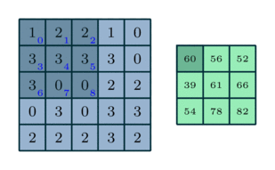
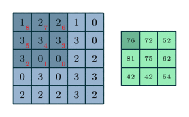

CorrRNN

This is my first post on my new fake blog! How exciting!

H~2~0


Correlation here:

<p align="center">
  
</p>


Convolution here
<p align="center">
  
</p>


## Mathematical Equations

Inline math with special characters: $|\psi\rangle$, $\Omega'$, $\gamma^\*$.  Bayes formula is $p(x|y) = \frac{p(y|x)p(x)}{p(y)}$.


In equation $\eqref{eq:sample}$, we find the value of an
interesting integral:

$$
\star *
\begin{equation}
  \int_0^\infty \frac{x^3}{e^x-1}\,dx = \frac{\pi^4}{15}
  \label{eq:sample}
\end{equation}
$$


Bigger equations:

$$
\begin{align}
E(\mathbf{v}, \mathbf{h}) = -\sum_{i,j}w_{ij}v_i h_j - \sum_i b_i v_i - \sum_j c_j h_j
\end{align}
$$

In multiline is:

$$
\begin{align}
                p(v_i=1|\mathbf{h}) & = \sigma\left(\sum_j w_{ij}h_j + b_i\right) \\\\
                p(h_j=1|\mathbf{v}) & = \sigma\left(\sum_i w_{ij}v_i + c_j\right)
\end{align}
$$


And without numbering:
$$
  \begin{align\*}
    |\psi_1\rangle &= a|0\rangle + b|1\rangle \\\\
    |\psi_2\rangle &= c|0\rangle + d|1\rangle
  \end{align\*}
$$

Miltiline alignment:
$$
\begin{equation} 
\begin{split}
A & = \frac{\pi r^2}{2} \\\\
  & = \frac{1}{2} \pi r^2 \\\\
  & = \frac{A}{B_{C}} \psi r^{\theta} \\\\
\end{split}
\end{equation}
$$

And matrices too:
$$
K_{\color{blue}{corr}} = 
 \begin{bmatrix}
  \color{blue}0 & \color{blue}1 & \color{blue}2 \\\\
  \color{blue}3 & \color{blue}4 & \color{blue}5 \\\\
  \color{blue}6 & \color{blue}7 & \color{blue}8  \\\\
 \end{bmatrix}
$$

$$
\begin{align\*}
K_{\color{red}{conv}} &= flip\big( K_{\color{blue}{corr}} \big) \\\\
                      &= 
 \begin{bmatrix}
  \color{red}8 & \color{red}7 & \color{red}6 \\\\
  \color{red}5 & \color{red}4 & \color{red}3 \\\\
  \color{red}2 & \color{red}1 & \color{red}0  \\\\
 \end{bmatrix}
\end{align\*}
$$


$$
I = 
 \begin{bmatrix}
  1&2&2&1&0 \\\\
  3&3&3&3&0 \\\\
  3&0&0&2&2 \\\\
  0&3&0&3&3 \\\\
  2&2&2&3&2 \\\\
 \end{bmatrix}
$$

$$
I \color{red}{*} K_{\color{red}{conv}} =  I \color{blue}{\star} K_{\color{blue}{corr}}
$$


Some Markdown text with some <span style="color:blue"> *blue* </span>text.


## Some code

Javascript
```javascript
function $initHighlight(block, flags) {
  try {
    if (block.className.search(/\bno\-highlight\b/) != -1)
      return processBlock(block, true, 0x0F) + ' class=""';
  } catch (e) {
    /* handle exception */
  }
  for (var i = 0 / 2; i < classes.length; i++) { // "0 / 2" should not be parsed as regexp
    if (checkCondition(classes[i]) === undefined)
      return /\d+/g;
  }
}
```

Python
```python
import time
# Quick, count to ten!
for i in range(10):
    # (but not *too* quick)
    time.sleep(0.5)
    print i
```


Here is an inline note.^[Inlines notes are easier to write, since
you don't have to pick an identifier and move down to type the
note.]


Here is an inline note.^[Inlines notes are easier to write, since
you don't have to pick an identifier and move down to type the
note.]


````bash
FROM kyma/docker-nginx
ADD public/ /var/www
CMD 'nginx'
````

## D3js


Next  


<iframe width="420" height="315" src="http://www.youtube.com/embed/_Kz8lito3U8" frameborder="0" allowfullscreen></iframe>


END