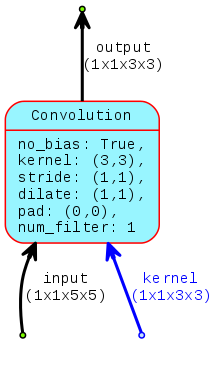

Here is a problem: we'd like to convolve convolve image $I$ with kernel $K$ where their definitions are

$$
I = 
 \begin{bmatrix}
  1&2&2&1&0 \\\\
  3&3&3&3&0 \\\\
  3&0&0&2&2 \\\\
  0&3&0&3&3 \\\\
  2&2&2&3&2 \\\\
 \end{bmatrix}
$$
$$
K = 
 \begin{bmatrix}
  0 & 1 & 2 \\\\
  3 & 4 & 5 \\\\
  6 & 7 & 8  \\\\
 \end{bmatrix}
$$

In terms of a computation graph for this we have a single node representing the operatr edges representing signal dimensions as full tensors

<p align="center">
  
</p>

This graph represents a sliding dot product computation according to one of the animations below:

<p align="center">
  
</p>

<p align="center">
  
</p>

Which of the two animations demonstrates the correct procedure for $convolve(I, K)$, the one with the <span style="color:blue"> blue </span>kernel or one with the <span style="color:red"> red </span> kernel?  

Scroll no further untill you've settled on an answer.


<br>
<br>
<br>
<br>
<br>
<br>

### Red or blue?


Both animations show a [MAC operation](https://en.wikipedia.org/wiki/Multiply%E2%80%93accumulate_operation) being performed as the kernel slides across the image, but the dfference is that the <span style="color:red"> red </span>kernel is a flip re-ordering of the original kernel $K$ colored <span style="color:blue"> blue</span>.

We may turn to the mathematical definition of 2D convolution to seek the answer

$$
C[x,y] = \sum_{j=-1}^{1} \sum_{i=-1}^{1} I[x+i,y+j]K[-i, -j]
$$

The indices are $0$ centered and specific to the signal dimensions used here:
* $x,y \in [ -1, 0, 1 ]$ for the result
* $i,j \in [-1, 0, 1 ]$ for the kernel
* $x+i,y+j \in [ -2, -1, 0, 1, 2 ]$ for the input image

In the definition the orientation of the kernel $\color{red}{K[-i, -j]}$ is a flip re-ordering of $\color{blue}{K[i,j]}$ so the correct answer is the <span style="color:red"> RED</span> animation shows convolution.

Testing this with Python Scipy to see the result gives

```python
import numpy as np
from scipy import signal

I = np.array([1,2,2,1,0,
              3,3,3,3,0,
              3,0,0,2,2,
              0,3,0,3,3,
              2,2,2,3,2]).reshape((5,5))

K = np.array([0,1,2,
              3,4,5,
              6,7,8]).reshape((3,3))

out = signal.convolve2d(I, K, 'valid')
    
print out
# out = 
#[[76 72 52]
# [81 75 62]
# [42 42 54]]

```

### What do the Deep Learning frameworks implement?

I decided to run a test in [MXNet](http://mxnet.io) to find out what sort of answer I'd get.  The python script below simulates the operator with signals $I$ and $K$ as defined above, expecting a result consistent with the mathematical definition i.e. the result of the <span style="color:red"> red</span> animation.


```python
import mxnet as mx

## Define operator as a computation graph
net  = mx.symbol.Convolution(data=mx.sym.Variable('I'), 
                             num_filter=1, 
                             kernel=(3,3), 
                             name="K")

## Create executor object for operator
c_exec = net.simple_bind(ctx=mx.cpu(), I=(1,1,5,5))

## Copy input arguments to executor space
args={}
args['I'] = mx.nd.array([1,2,2,1,0,
                         3,3,3,3,0,
                         3,0,0,2,2,
                         0,3,0,3,3,
                         2,2,2,3,2]).reshape((1,1,5,5))
args['K_weight'] = mx.nd.array([0,1,2,
                                3,4,5,
                                6,7,8]).reshape((1,1,3,3))
c_exec.copy_params_from(arg_params=args)

## Print arguments
print c_exec.arg_dict['I'].asnumpy()
print c_exec.arg_dict['K_weight'].asnumpy()

## Forward arguments through computation graph
c_exec.forward()

## Show output
print c_exec.outputs[0].asnumpy()

# Result shows a correlation result:
#
#[[[[ 60  56  52]
#   [ 39  61  66]
#   [ 54  78  82]]]]
#
```

So according to MXNet, the implementation of convolution does not take into account a flip of the kernel and is infact performing a correlation.  This pattern is not unique to MXNet but is common across all other frameworks.  

So why are the frameworks implementing it in this way when the math clearly states what should be done?  To understand this we have to take a step back and appreciate how convolution and correlation are related.

### More on the Math.

Lets introduce some notation:
* $\color{red}{*}$ to denote <span style="color:red"> convolution</span>.  This is implemented in terms of correlation with a flipped kernel.
* $\color{blue}{\star}$ to denote <span style="color:blue"> correlation</span>.  This is implemented as sliding dot product.

What is requested when the convolution operator is invoked is identity $\eqref{eq:corrflp}$ but what is actually performed is the RHS of identity $\eqref{eq:corr}$ below.

$$
  \begin{align}
    \color{red}{convolve}(I, K) &=  \color{blue}{correlate}(I, K_{flipped})
    \label{eq:corrflp}
  \end{align}
$$

$$
  \begin{align}
    \color{red}{convolve}(I, K_{flipped}) &=  \color{blue}{correlate}(I, K)
    \label{eq:corr}
  \end{align}
$$

Using actual matrices, the kernels looks like

$$
K_{\color{blue}{corr}} = 
 \begin{bmatrix}
  \color{blue}0 & \color{blue}1 & \color{blue}2 \\\\
  \color{blue}3 & \color{blue}4 & \color{blue}5 \\\\
  \color{blue}6 & \color{blue}7 & \color{blue}8  \\\\
 \end{bmatrix}
$$

$$
\begin{align\*}
K_{\color{red}{conv}} &= flip\big( K_{\color{blue}{corr}} \big) \\\\
                      &= 
 \begin{bmatrix}
  \color{red}8 & \color{red}7 & \color{red}6 \\\\
  \color{red}5 & \color{red}4 & \color{red}3 \\\\
  \color{red}2 & \color{red}1 & \color{red}0  \\\\
 \end{bmatrix}
\end{align\*}
$$

and identity $\eqref{eq:corr}$ expands to 

$$
 \begin{bmatrix}
  1&2&2&1&0 \\\\
  3&3&3&3&0 \\\\
  3&0&0&2&2 \\\\
  0&3&0&3&3 \\\\
  2&2&2&3&2 \\\\
 \end{bmatrix}\color{red}{*}
 \begin{bmatrix}
  \color{red}8 & \color{red}7 & \color{red}6 \\\\
  \color{red}5 & \color{red}4 & \color{red}3 \\\\
  \color{red}2 & \color{red}1 & \color{red}0  \\\\
 \end{bmatrix}=
 \begin{bmatrix}
  1&2&2&1&0 \\\\
  3&3&3&3&0 \\\\
  3&0&0&2&2 \\\\
  0&3&0&3&3 \\\\
  2&2&2&3&2 \\\\
 \end{bmatrix}\color{blue}{\star}
 \begin{bmatrix}
  \color{blue}0 & \color{blue}1 & \color{blue}2 \\\\
  \color{blue}3 & \color{blue}4 & \color{blue}5 \\\\
  \color{blue}6 & \color{blue}7 & \color{blue}8  \\\\
 \end{bmatrix}
$$

which in shorthand is

$$
I \color{red}{*} K_{\color{red}{conv}} =  I \color{blue}{\star} K_{\color{blue}{corr}}
$$


### Correlation Neural Networks, rather.

It turns out that Convolutional Neural Network is a bit of a misnomer, depending on how you think about it.  Two lines of thought:

1. It is implicit in the operators assumption that the kernel be flipped - The training algorithm is learning flipped kernels, so that additional flipping isnt required.
2. The operator is incorrectly names 

> The convolution operator in ConvNets is not implemented as convolution, but rather, as correlation.  A more appropriate name for ConvNets is infact CorrNet.


> From a Signal Processing view, convolution is the link that bridges time domain correlation with frequency domain concepts.  Formally this link is known as the Convolution Theorem.


... performing a^[In Digital Signal Processing, the multiply–accumulate operation is fundamental and is the basis upon which dot product procedures are implemented.], also known as the dot product.  


And matrices too:


Some Markdown text with some <span style="color:blue"> *blue* </span>text.

WHat do the deep learning frameworks do.  For this test I've used the [MXNet](http://mxnet.io/) which provides the `mx.symbol.Convolution` operator for this functionality.


Some text in which I cite an author.[^fn1]

More text. Another citation.[^fn2]

What is this? Yet *another* citation?[^fn3]

[^fn1]: So Chris Krycho, "Not Exactly a Millennium," chriskrycho.com, July 22,
    2015, http://www.chriskrycho.com/2015/not-exactly-a-millennium.html
    (accessed July 25, 2015), ¶6.

[^fn2]: Contra Krycho, ¶15, who has everything *quite* wrong.

[^fn3]: ibid.


END